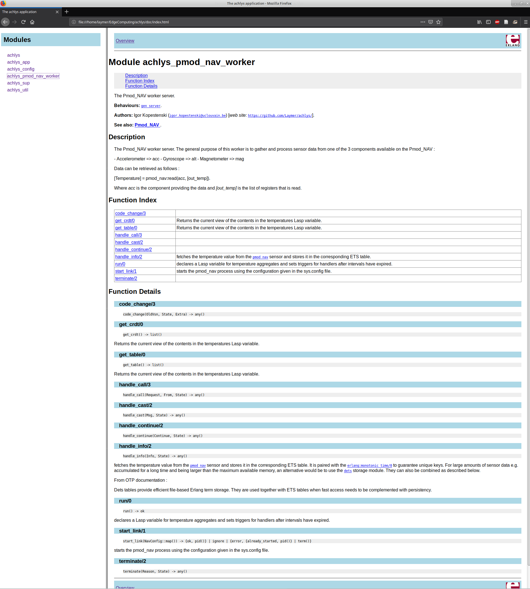
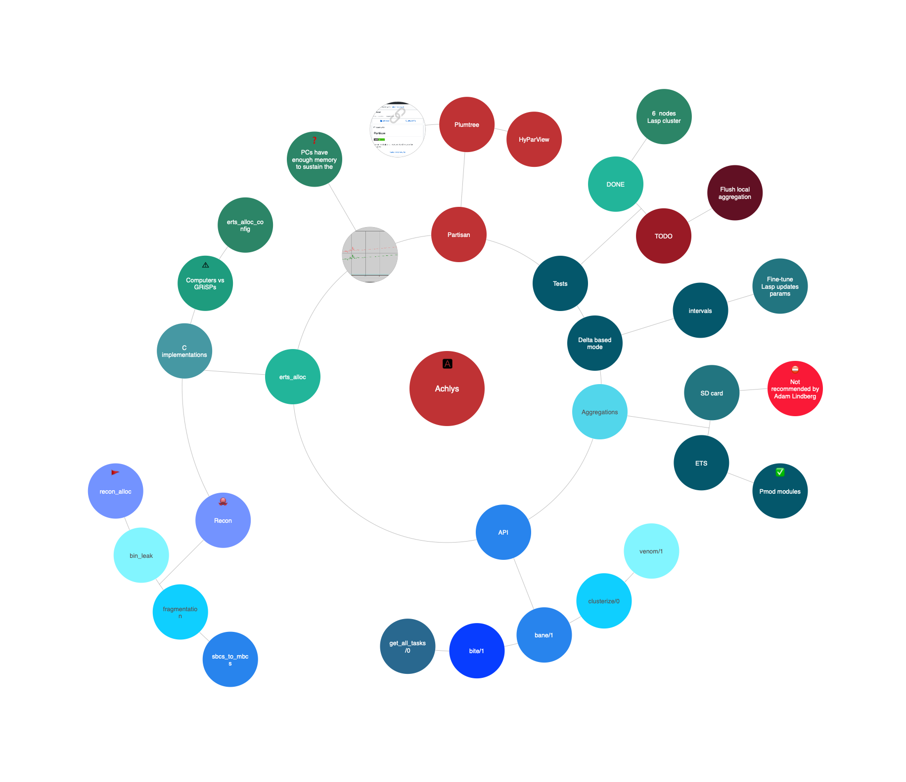

# Achlys
The Achlys framework is a tool designed to help application developers build Erlang/OTP programs using the [Lasp](https://lasp-lang.readme.io) libraries and running on [GRiSP](https://grisp.org) embedded systems in a wireless sensor network configuration. A more detailed description is available in this [document](https://www.info.ucl.ac.be/~pvr/p875-kopestenski.pdf?bclid=IwAR1QlcSpH76ikzte38eR5cCaQseOBizzHjZ5tHCBZ1_fWUqZIf8HIwjZM1E).

## Demonstration (turn on CC  !)
[Achlys tasks](https://youtu.be/HhOvTt5Gj2Y)

Achlys is being developed in the context of edge computing research within the H2020 [LightKone](https://lightkone.eu) project. The 2 main objectives of the framework are to provide :

- Resilient storage across a cluster of IoT sensing devices
- A general purpose task model allowing any function to be propagated and executed in the cluster

Disclaimer : Achlys is currently under active development, hence a production-ready release is not yet available.

> Achlys is the goddess of deadly poison ... but fortunately there is an [AntidoteDB](https://www.antidotedb.eu/)

## Minimum requirements

- [otp](https://github.com/erlang/otp) `22.0`
- [rebar3](https://github.com/erlang/rebar3) `3.12.0`
- [grisp](https://github.com/grisp/grisp) `1.1.6`
- [rebar3_grisp](https://github.com/grisp/rebar3_grisp) `1.2.6`

## Development requirements (optional)

- [grisp-software](https://github.com/grisp/grisp-software) : a fully built grisp toolchain.
- [grisp_tools](https://github.com/grisp/grisp_tools) `0.2.6` or above
- [partisan](https://github.com/lasp-lang/partisan) `3.0.0` or above
- [lasp](https://github.com/lasp-lang/lasp) `0.9.0` or above

## Deployment guide

Additional information on the deployment of GRiSP applications with Achlys can be found below :

- [Deployment guide](https://github.com/achlysproject/achlys/blob/master/resources/DEPLOY.md)

## Wiki

A [Wiki](https://github.com/achlysproject/achlys/wiki/Achlys-Wiki) is currently being written and will aim at providing a wide
range of examples and tutorials in order to demonstrate the capabilities of Lasp on GRiSP at the Edge.

The [GRiSP Wiki](https://github.com/grisp/grisp/wiki) also provides necessary steps in order to setup the required dependencies in order to run Achlys on the GRiSP boards. There are also useful resources that are interesting for general usage of GRiSP boards.

Elixir is also supported on GRiSP, and there two very interesting articles by [@Theuns-Botha](https://github.com/Theuns-Botha) that provide detailed information on how to setup an Elixir development environment :

- [Going bare metal with Elixir and GRiSP](https://medium.com/@toensbotes/going-bare-metal-with-elixir-and-grisp-8fa8066f3d39)
- [IEx Remote Shell into your Elixir driven GRiSP Board](https://medium.com/@toensbotes/iex-remote-shell-into-your-elixir-driven-grisp-board-76faa8f2179e)

## EDoc preview

The development process has not yet reached a level of maturity allowing for an actual release of the program.
Therefore, the documentation is currently more of an insight at the software design and more generally at
the features that will be provided.

Once a satisfactory amount of testing and features will be implemented, a versioned package will be released and the documentation will be a reliable set of specifications.

The online version of the documentation is found at :

[HexDocs](https://hexdocs.pm/achlys)

### Architecture

The design pattern will follow the "facade" concept as much as possible, hence there will be an API that will provide an easy access to all the modules and functions. The documentation will be reorganized to focus on thoroughly explaining the usage, and will regroup the information of submodules like these :

  

## Mind map

A [Mindly](http://www.mindlyapp.com) reasoning construct.
Allows for easier visualization of problems and tasks, hence more efficient solving.
- The **API** branch of the map provides a description of some features and simple usage examples.
- For Achlys, it is currently an additional asset to structure software improvement ideas.

### NOTE : An online interactive version is available [here](https://achlysproject.github.io/achlys-map/)

  

