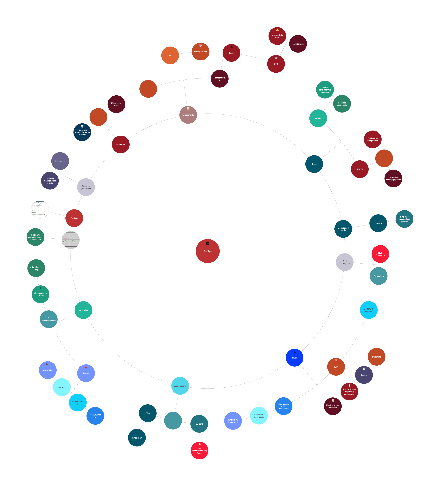

# Achlys
Achlys is the goddess of deadly poison ... but fortunately there is an [AntidoteDB](https://www.antidotedb.eu/)

## EDoc preview

  

## Mind map

A [Mindly](http://www.mindlyapp.com) reasoning construct. 
Allows for easier visualization of problems and tasks, hence more efficient solving.
For Achlys, it is currently an additional asset to structure software improvement ideas. 

### NOTE : An online interactive version is available [here](https://laymer.github.io/achlys-map/)

  

